# ⌨⌨ ZMK Configuration

[ZMK](https://github.com/zmkfirmware/zmk) firmware configuration for two keyboards sharing a
single keymap:

- a [Corne keyboard](https://github.com/foostan/crkbd) from Typeractive (`nice_nano_v2`)
- a [Toucan2](https://docs.beekeeb.com/toucan2-keyboard) from beekeeb (`seeeduino_xiao_ble`,
  with a display and an Azoteq trackpad)

This configuration uses the [Graphite](https://github.com/rdavison/graphite-layout) layout with [home row mods](https://precondition.github.io/home-row-mods).

Both boards are 42-key with identical key numbering, so the keymap, behaviors and combos live
once in [`config/shared/`](./config/shared) and each keyboard's `.keymap` is a one-line
include. See [the multi-keyboard plan](./docs/multi-keyboard-plan.md) for the details and the
constraints that come with it.

## Layout



> Generated with [Keymap Drawer](https://github.com/caksoylar/keymap-drawer).

**One diagram covers both keyboards.** It is drawn on the Corne's physical layout, but the
bindings, layers and combos are the same on the Toucan2. The only layer that behaves
differently is `Mouse`, which the Toucan2's trackpad activates while a finger rests on it and
which is unreachable on the Corne.

`Adjust` is reached by holding both thumb layer keys together (tri-layer).

## Key Positions

Used as `key-positions` for [combos](https://zmk.dev/docs/keymaps/combos). Identical on both
keyboards.

```
Left half (21 keys)       Right half (21 keys)
-------------------       -------------------
  0   1   2   3   4   5       6   7   8  9  10  11
 12  13  14  15  16  17      18  19  20 21  22  23
 24  25  26  27  28  29      30  31  32 33  34  35
              36  37  38    39  40  41
```

## Building firmware

The firmware and diagrams are built via GitHub Actions workflow. Each release attaches a
`firmware-<version>.zip` containing:

| File | Flash to |
| --- | --- |
| `corne_left.uf2` / `corne_right.uf2` | Corne halves |
| `toucan2_left.uf2` / `toucan2_right.uf2` | Toucan2 halves |
| `corne_settings_reset.uf2` | Corne, to clear stored settings |
| `toucan2_settings_reset.uf2` | Toucan2, to clear stored settings |

Alongside the zip it attaches the keymap diagram as it stood at that version, as
`keymap-<version>.svg` and `keymap-<version>.png` — the SVG the site uses, plus a
light-themed 2x render of it for anywhere an SVG is awkward. The diagram in this README
always tracks `main`, so the release assets are the only record of what the keymap looked
like on an older firmware.

Both are self-identifying: the base layer's label is the version, in the gutter where the
other layers print their name, because that layer's display-name *is* `KEYMAP_VERSION`. A
diagram that has been saved, pasted or printed still says which firmware it belongs to, and
the release workflow refuses to attach one whose label does not match the version being
released.

The version shown on each keyboard's display while on the base layer is stamped into
[`config/shared/version.dtsi`](./config/shared/version.dtsi) by the release workflow — that is
how you tell which firmware a board is running.

## Drawing the Keymap Locally

You can generate and preview the keymap SVG diagram locally using [Keymap Drawer](https://github.com/caksoylar/keymap-drawer):

- **Windows (PowerShell):**
  ```powershell
  powershell -File .\scripts\draw.ps1
  # Or specify a keymap:
  powershell -File .\scripts\draw.ps1 corne
  ```
- **macOS / Linux:**
  ```bash
  ./scripts/draw.zsh
  # Watch for changes and redraw automatically:
  ./scripts/watch-draw.zsh
  ```

This generates `keymap-drawer/corne.local.svg` (gitignored), allowing you to review visual changes locally before committing.

## Interactive Keymap Viewer

The keymap is published as an interactive web viewer on Cloudflare Pages. See [`site/README.md`](./site/README.md) for web development, tooltip authoring, and deployment instructions.
